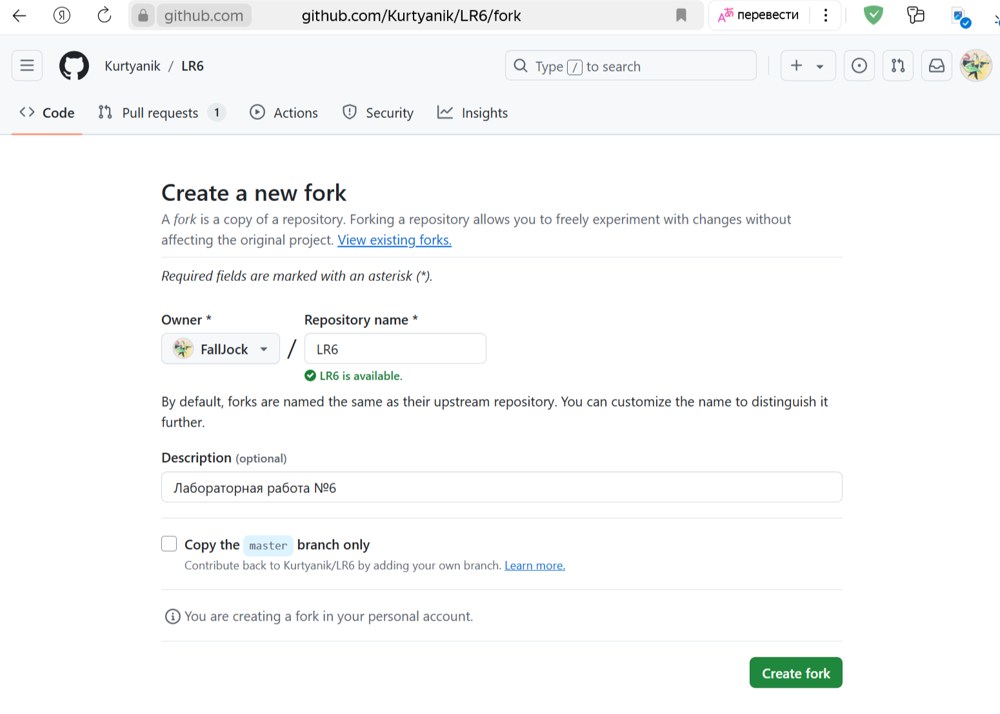
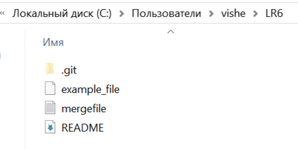
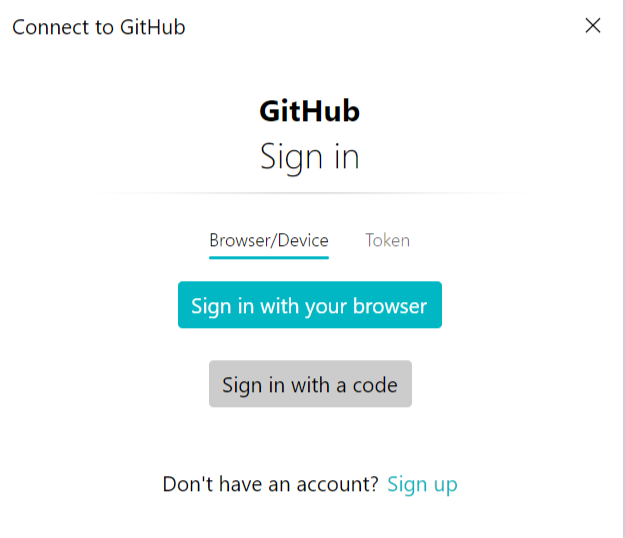
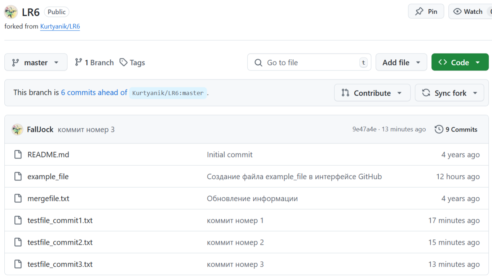
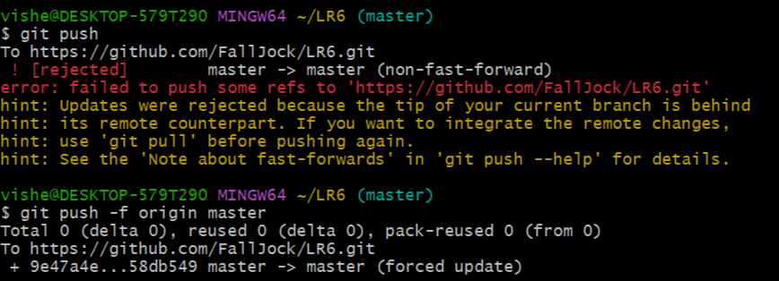

# Лабораторная работа №6 - GitHub

__Цель работы:__ изучение базовых возможностей системы управления версиями, опыт работы с Git Api, опыт работы с локальным и удаленным репозиторием.

__Студент – Лукиян Диана Владимировна__

__Группа – 4314__

\
Работа с github-ом будет производится пользователем – FallJock\

## Клонирование репозитория
Создадим копию [репозитория](https://github.com/Kurtyanik/LR6) через fork.



После создания, появятся все файлы с репозитория, которые можно менять или добавлять новые, но при этом репозиторий автора не будет изменён.


## Установка Git
Скачиваем Git с [официального сайта](https://git-scm.com/) для дальнейшей работы в Git.\
Для этой работы используется операционная система Windows 64-bit и устанавливаем на одного пользователя vishe.


## Настройка клиента git
Запускаем Git Bash.


Укажем свой никнейм и почту из GitHub. \
Это нужно указать, потому что каждый коммит в Git содержит эту информацию.

Через команды:
```bash
git config --global user.name "FallJock"
git config --global user.email FallJock@yandex.ru
```

\


## Клонирование личного удалённого репозитория на компьютер
Создаём клон репозитория на компьютер (локально) через команду:
```bash
git clone https://github.com/FallJock/LR6
```

\


## Добавления файла через интерфейс GitHub


Добавим файл через интерфейс GitHub.\
В репозитории Github создаём новый файл нажимая __Add file >> Create new file__
 


\
Добавляем название файла и его содержимое
 


\
Нажимаем на кнопку Commit changes…
 


\
Добавляем сообщения для коммита и нажимаем Commit changes
 


\
Файл example_file появился на Github-е
 


## Добавления изменений из удалённого в локальный репозиторий
Переходим в папку локального репозитория через команду:
```bash
cd LR6
```
Обновляем локальный репозиторий на компьютере (добавляем изменения с GitHub) в Git через команду:
```bash
git pull
```


\
Проверим папку локального репозитория, и увидим, что файл example_file добавился
 


## Вывод истории операций для каждой из веток
Просмотрим историю операций для каждой из веток через команду:
```bash
git log --all
```
`--all` – показывает все ветки (master и branch1), без него тот покажет только нашу ветку master


 
## Просмотр последних изменений
Просмотрим последние изменения через команду:
```bash
git log -p -1
```
`-p` – показывает разницу (выводит патч), внесённую в каждый коммит;
`-1` – покажет только одно последние изменение.


## Слияние в ветку master
Ветка на которой мы находимся – master. \
Просмотрим, какие ветки существует через команду:
```bash
git branch –a
```


\
Попробуем сделать слияние ветки master с branch1 командой:
```bash
git merge branch1
```
Возник конфликт с файлом `mergefile.txt`.

 

### Решение конфликта
Решим конфликт в редакторе Visual Studio Code
Можем увидеть два разных изменений от HEAD (текущее) и branch1 (входящее).

 

\
Принимаем изменения только от HEAD (текущее изменение) и сохраняем файл.
 
 

\
Делаем коммит (фиксируем изменения файла `mergefile.txt`)
Добавляем файл:
```bash
git add mergefile.txt
```
И приписываем описания коммита:
```bash
git commit -m"Изменение файла mergefile.txt"
```

 

\
Пробуем снова сделать слияние веток.

 
 
Слияние прошло успешно.

## Удаление побочной ветки

Удалим не нужную ветку branch1 командой:
```bash
git branch -d branch1
```

 

\
Отправляем изменения в удаленный репозиторий командой, удаляя тоже там ветку branch1:
```bash
git push origin --delete branch1
```
после введения этой команды, нас попросят войти в гитхаб с удалённым репозиторием, так как нужно добавить изменения в удалённый репозиторий автора FallJock.

 

\
После этого `git bash` покажет, что ветка branch1 удалена.
 
 

\
В удалённом репозитории была удалена ветка branch1.
 
 

## Откат коммита
### Добавление новых коммитов
Добавляем 3 новых коммита с 3 разными файлами и сообщениями.

 

\
Переносим изменения в удалённый репозиторий командой:
```bash
git push
```

 

\
3 добавленных файла с разными сообщениями были добавлены в удалённый репозиторий.

 

\
Откатим до предыдущего коммита (коммит номер 2)
Для этого выясним хэш коммита командой:
```bash
git log
```

 

\
Хэш коммита отменяемого коммита  - 
`58db549b059effe1085e21366f39166d52da22cd`

Делаем откат командой:
```bash
git reset 58db549b059effe1085e21366f39166d52da22cd
```

 

\
Чтобы добавить откат в удалённый репозиторий нужно сделать откат принудительно через атрибут `–f (--force)`:
```bash
git push –f origin master
```



Откат в удалённом репозитории на GitHub.

 

## Создание ветки
Создадим новую ветвь для создания отчёт:
```bash
git branch report
git checkout report
```
Теперь изменения будут делаться в ветке report.


## История операций в форматированном виде
Форматированние выполняем командой:
```bash
git log --pretty=format:"%h + %ad + %an + %s"
```
`%h` - Сокращённый хеш коммита;\
`%ad` - Дата автора;\
`%an` - Имя автора;\
`%s` - Содержание.


## Вывод
Я узнала как работать с Git. Клонировать репозитории и работать как удалённо так и локально на компьютере, а также передавать изменения репозитория из локального в удалённый и наоборот.\
Научилась создавать ветки, удалять и создавать слияние, и решила конфликт при слиянии веток.\
Смогла совершить откат коммита.\
Также научилась создавать коммиты и работать в редакторе для удобного изменения файлов.